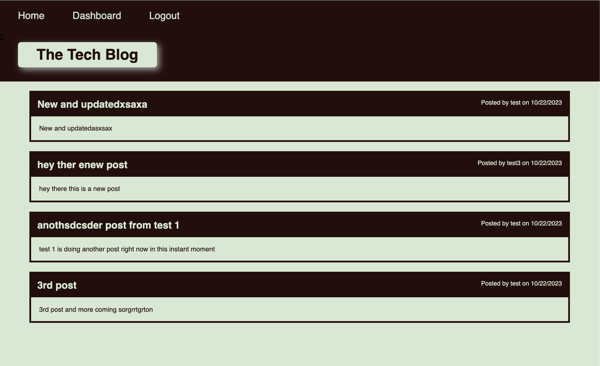

# Object-Relational Mapping[License: MIT)](https://img.shields.io/badge/License-MIT-yellow.svg)
    
## Description

> ### What was your motivation?
> To see what its like to build a full web stack app using all types of routes.

> ### Why did you build this project?
> To learn how to use express-sessions, handlebars, and many other npm packages

> ### What problem does it solve?
> Creating a full web app with all CRUD functions

> ### What did you learn?
> How to set up a MVC express/node app. I learned all the necessary steps needed to build out a fully functioning app.
  

## Table of Contents
- [Installation](#installation)
- [Usage](#usage)
- [License](#license)
- [Contributing](#contributing)
- [Tests](#tests)

## Installation

NPM Packages used were - bcrypt, dayjs, dotenv, express, express-handlebars, express-session, mysql2, sequelize
-

## Usage

## License
MIT License Info.

## Badges

## Contributing
No one at the moment.

## Tests
Rodolfo Espinosa Nunez

## Questions for me?
Shoot me an email to rodolfoespinosa01@gmail.com

## Github Profile
Visit my Github profile!
https://github.com/rodolfoespinosa01

## Project Repo
https://github.com/rodolfoespinosa01/bc_c14_mvc

## Video walkthrough
